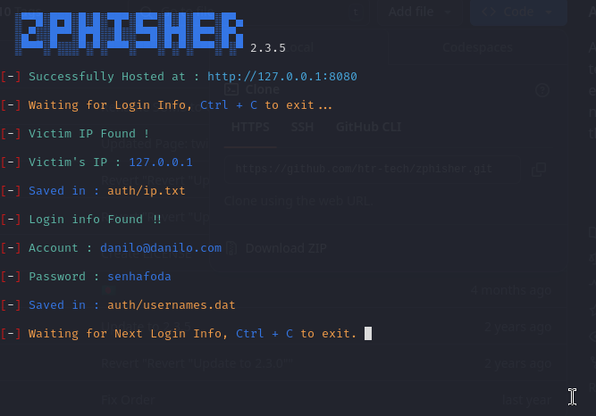

# Phishing para captura de senhas do Facebook

### Ferramentas

- Kali Linux
- Zphishing

### Configurando o Phishing no Kali Linux

- Baixe o repositorio do Zphishing: ``` https://github.com/htr-tech/zphisher.git ```
- Navegue até a pasta do Zphishing e inicie com o comando: ``` bash zphisher.sh ```
- Opção de ataque: ``` 01```
- Qual tipo de página será gerada: ``` 01```
- Onde será hospedado: ```01 ```
- Customização de porta: ``` n ```

### Resutados



# cibersecurity-desafio-phishing
